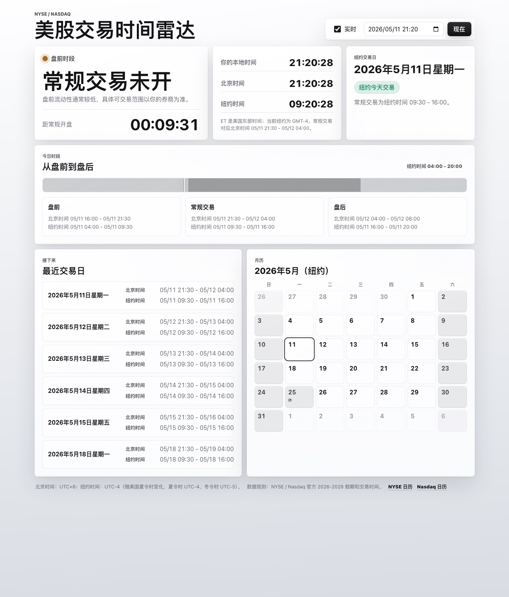

# US Stock Time

A tiny static dashboard for checking whether the US stock market is open, with Beijing time and New York time shown side by side.

## Features

- Shows the current NYSE / Nasdaq trading status.
- Converts regular, pre-market, and after-hours sessions between Beijing time and New York time.
- Handles US daylight saving time through the browser time-zone database.
- Includes NYSE / Nasdaq holidays and early closes for 2026-2028.
- Runs as a static site with no build step and no external dependencies.

## Usage

Open `index.html` directly in a browser, or publish this folder with GitHub Pages.

## Notes

Beijing time: UTC+8.

New York time changes with US daylight saving time: UTC-4 during daylight saving time, UTC-5 during standard time.
